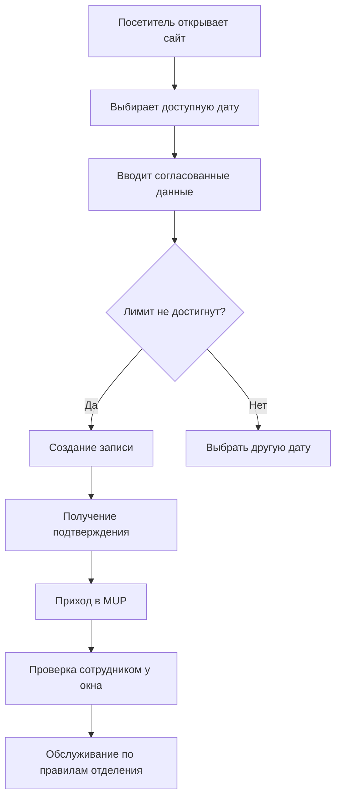

# Пользовательские сценарии

```mermaid
flowchart TD
  A[Посетитель открывает сайт] --> B[Выбирает доступную дату]
  B --> C[Вводит согласованные данные]
  C --> D{Лимит не достигнут?}
  D -->|Да| E[Создание записи]
  D -->|Нет| F[Выбрать другую дату]
  E --> G[Получение подтверждения]
  G --> H[Приход в MUP]
  H --> I[Проверка сотрудником у окна]
  I --> J[Обслуживание по правилам отделения]
```

**Важно:** форма, способ проверки и порядок вызова пока проектные решения, не реальные процессы MUP. Проход через отдельный пост контроля не предусмотрен.